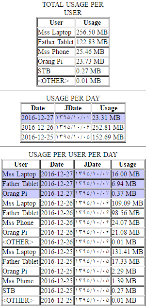

# Netmon
A simple traffic monitor for users based on mac address for raspbery pi/orange pi

This is simple php project that use wireshark cli (tshark) to capture and analyse transform packages and extract mac and traffic from them.

**Install**

 1. This project need to `php` , `apache`, `mysql` , `tshark` , `upstart` be installed.
Upstart and tshark for Debian/Ubuntu installation described bellow:

        apt install tshark upstart

   While installing `wireshark-common` it ask you about install wireshark     user group and you should choose yes to allow run it as limited user. 
 

 2. Now should install service by coping `upstart/netmon.conf` to `/etc/init`.

 3. Put the project files in the `/var/www/html/netmon` Then you should
    create  database and tables by importing the `database/import.sql`.

 4. start service using `service netmon start`. Service run as
    `www-data` the apache user.

 5. Now run simple data summery by navigating
    `http://<server-id>/netmon`

Preview:

For monitoring traffic I enabled ip4_forwarding and use the pi as internet access point:

[MyComputer] <======> (Orange PI) <======> [Internet Router]

This project inspired from ronenb blog , you can find more helpful manual there :

http://blog.ronenb.com/2016/08/20/network-traffic-analyzer-with-raspberrypi/

Also I used this guide to install wirelless ap on my pi:

https://frillip.com/using-your-raspberry-pi-3-as-a-wifi-access-point-with-hostapd/
